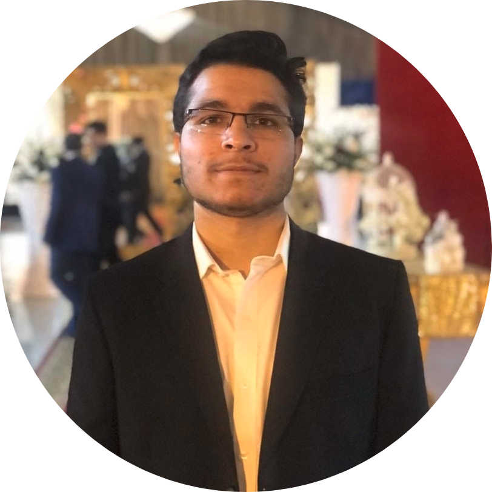

<ul class="sticky">
  <li><a class="active" href="index">Profile</a></li>
  <li><a href="projects">Projects</a></li>
  <li><a href="about">About</a></li>
  <li><a href="files/MuhammadUzairKhattak.pdf">Resume</a></li>
</ul>

Hi, I am Muhammad Uzair Khattak, a Computer Vision Master research student in the <a href="https://mbzuai-cv-lab.netlify.app//">Computer Vision Lab</a> at <a href="https://mbzuai.ac.ae">Mohamed Bin Zayed University of Artificial Intelligence </a>. I am advised by <a href="https://scholar.google.es/citations?user=M59O9lkAAAAJ">Dr. Salman Khan</a> and <a href="https://scholar.google.com/citations?user=zvaeYnUAAAAJ&hl=en">Dr. Fahad Khan</a>. At MBZUAI, my overall research focus is on <b>object recognition and detection using multi-modal (text and vision) transformers </b>. Currently, I am carrying research on <b>prompt learning for adapting large-scale vision-language models for few-shot and zero-shot learning</b>. 

## What's New!

 <ul>
   <li>
     <b>[June-2022]</b> I attended <b>CVPR-2022</b> Computer Vision conference virtually.
  </li>  
      <li>
    <b>[Nov-2021]</b> Our team won second position in <b>Road & Transport Authority - RTA TRANSPORT HACKATHON, 2022!</b> <a href="https://mbzuai.ac.ae/news-events/Students-solve-real-world-challenges">(more details) </a>
  </li>  
  <li>
    <b>[Dec-2021]</b> Our team won third position in <b> Hack for Space hackathon organized by G42 and #CodersHQ!</b>
  </li>  
    <li>
    <b>[Nov-2021]</b> Our team won first position in Agrithon challenge, organized by Abu Dhabi Agriculture and Food Security Authority! <a href="https://mbzuai.ac.ae/news-events/Innovating-Agritech-serving-the-nation">(more details) </a>
  </li>  
  <li>
    <b>[Sept-2021]</b> We participated in MBZUAI Cats vs Dogs AI challenge and won first prize! <a href="https://github.com/muzairkhattak/Final-code">(Code / Report) </a>
  </li>  
  <li>
    <b>[Aug-2021]</b> Joined <a href="https://mbzuai.ac.ae">MBZUAI</a> as a Computer Vision graduate research student.
  </li>
    <li>
      <b>[July-2021]</b> Participated in AI workshop <b>”AI at the Edge”</b> as technical instructor. Led workshop labs on NN quantization techniques using PyTorch and Brevitas <a href="https://ai-lounge.com/ai-news/">(more details) </a>
  </li>    
    <li>
    <b>[April-2021]</b> Our undergraduate project titled <b>"Whole Slide Image Scanner with Deep Learning Applications"</b> won rector's Gold Medal award, NUST, Pakistan. <a href="">(presentation slides) </a>
  </li>
    <li>
    <b>[Dec-2020]</b> Selected as NVIDIA certified Jetson AI specialist <a href="https://www.linkedin.com/posts/muhammad-uzair-khattak-204ba1150_embedded-nvidiajetson-deeplearning-activity-6735567828964909056-MxQo?utm_source=linkedin_share&utm_medium=member_desktop_web">(certification) </a>
  </li>  
    <li>
      <b>[Dec-2020]</b> Delivered hands-on workshop on <b>Deep Learning with PyTorch</b>, organized by IEEE SEECS and NUST Cyber Security Club. <a href="https://www.youtube.com/watch?v=w6BqCdB9BsY">(session recording) </a>
  </li>    
    <li>
    <b>[Oct-2020]</b> Attended <a href="https://nvidianews.nvidia.com/news/nvidia-announces-gtc-2020-keynote-with-ceo-jensen-huang-set-for-may-14">NVIDIA GTC-2020 </a> conference virtually. 
  </li>  
      <li>
    <b>[Aug-2019]</b> I was awarded participation grant for 3rd IAPR Summer School on Document Analysis, Islamabad, Pakistan. <a href="http://pprs.org.pk/events/ssda2019.html">(more details) </a>
  </li>   
</ul> 

