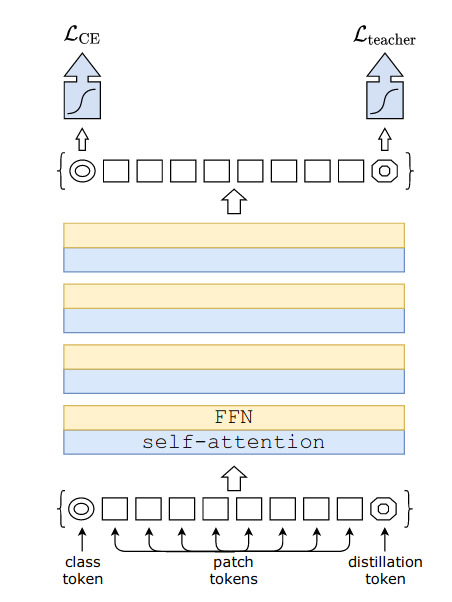
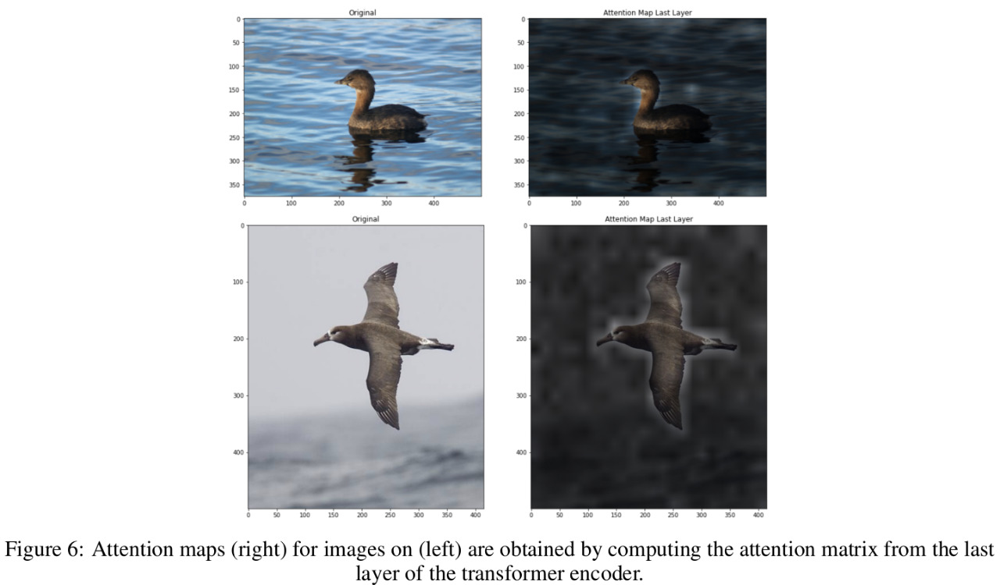
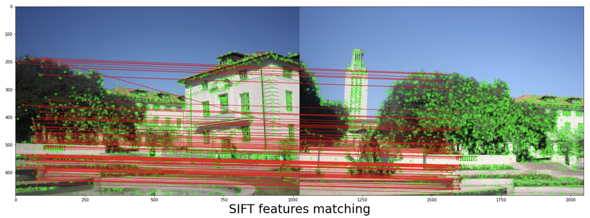
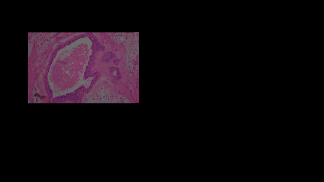
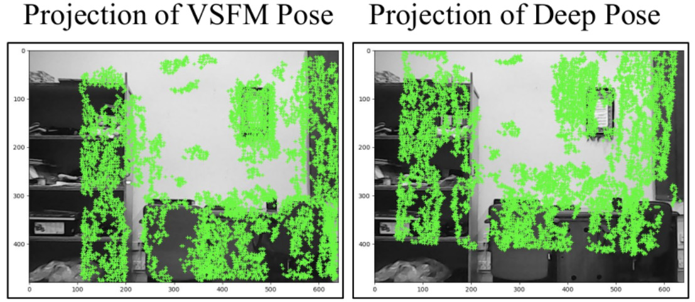
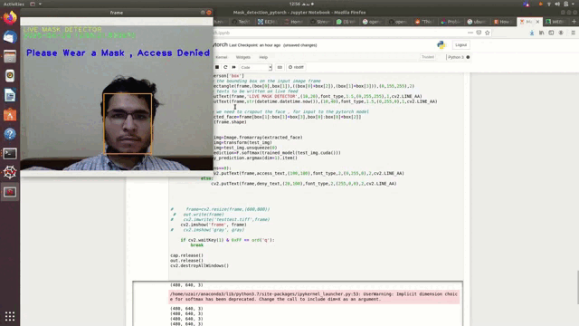
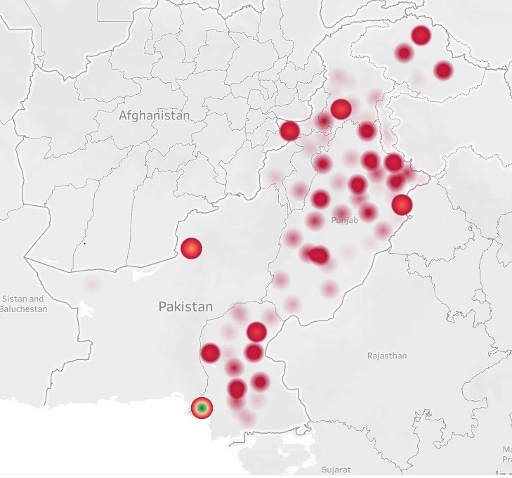

<ul class="sticky">
  <li><a href="index">Home</a></li>
  <li><a class="active" href="projects">Projects</a></li>
  <li><a href="about">About</a></li>
  <li><a href="files/MuhammadUzairKhattak.pdf">Resume</a></li>
</ul>

## Academic Projects
Below, I have enlisted selected academic projects.
 
 

<table style="width:100%;border:0;border-spacing:0px;border-collapse:separate;margin-right:auto;margin-left:auto;border-color:white">
<tbody>

<tr>
<td style="padding:20px;width:50%;vertical-align:middle">

</td>
<td style="padding:20px;width:50%;vertical-align:middle">

<strong>Learning with Knowledge Distillation for Fine Grained Image Classification</strong>
   
 <a href="https://github.com/muzairkhattak/DeiT_ConvNeXt_KnowledgeDistillation">Code</a>&nbsp;/&nbsp;<a href="https://github.com/muzairkhattak/DeiT_ConvNeXt_KnowledgeDistillation/blob/deit_convnext/FGVC_report.pdf">Technical report</a>
  <ul>
    <li>
 In this project, we explored advanced CNNs (ConvNexts) and ViTs (DeiT) for the task of fine-grained image classification.</li>
            <li>
  On custom challenging fine-grain visual dataset, we combined the benefits of both ConvNext and DeiT models by applying knowledge distillation in the finetuning stage. </li>
  </ul>
</td>

</tr>    
        
</tbody>
</table>

<table style="width:100%;border:0;border-spacing:0px;border-collapse:separate;margin-right:auto;margin-left:auto;border-color:white">
<tbody>

<tr>
<td style="padding:20px;width:50%;vertical-align:middle">

</td>
<td style="padding:20px;width:50%;vertical-align:middle">

<strong>Transformers transforming Vision</strong>
   
 <a href="https://github.com/muzairkhattak/transformers-transforming-vision">Code</a>&nbsp;/&nbsp;<a href="https://github.com/muzairkhattak/transformers-transforming-vision/blob/main/transformerstransformingvision_project_report.pdf">Technical report</a>
  <ul>
    <li>
 Explored vision transformers for image classification including ViTs, DeiTs and T2T-ViTs.</li>
            <li>
  We compared ViTs and DeiTs with CNN models (ResNets) and evaluated their performance scalability capabilities w.r.t
pretraining dataset size. </li>
        <li>
  Benchmarked pretrained Vision Transformers and ResNets on downstream datasets CIFAR10,
CIFAR100 and CUB-200 </li>
  </ul>
</td>

</tr>    
        
</tbody>
</table>

<table style="width:100%;border:0;border-spacing:0px;border-collapse:separate;margin-right:auto;margin-left:auto;border-color:white">
<tbody>

<tr>
<td style="padding:20px;width:50%;vertical-align:middle">

</td>
<td style="padding:20px;width:50%;vertical-align:middle">

<strong>Image Stitching Using Homography Techniques</strong>
   
 <a href="">Code</a>&nbsp;/&nbsp;<a href="">Technical report</a>
  <ul>
    <li>
 In this project, we revisited the classical techniques for image stitching. We explored different feature detectors and descriptors techniques (SIFT, SURF etc.) to obtain robust feature points to be used for image stitching.</li>
        <li>
  We experimented with different photometric correction methods to seamlessly blend the overlapping parts of stitched images.</li>
  </ul>
</td>

</tr>    
        
</tbody>
</table>

<table style="width:100%;border:0;border-spacing:0px;border-collapse:separate;margin-right:auto;margin-left:auto;border-color:white">
<tbody>

<tr>
<td style="padding:20px;width:50%;vertical-align:middle">

</td>
<td style="padding:20px;width:50%;vertical-align:middle">

<strong>Optimizing Deep Learning models with TensorRT</strong>

  <ul>
    <li>
 In this work, I explored NVIDIA TensorRT library in Python to optimize AI models (YOLOv4, ResNets) to increase real time inference
performance on NVIDIA embedded edge devices including Jetson Nano and Jetson TX2.</li>
            <li>
  Explored DL model’s optimization techniques including weights quantization, layer fusion and kernel auto-tuning
supported by TensorRT. </li>
        <li>
  Performance metrics: FPS, total inference time and accuracy were compared before and after optimization. </li>
  </ul>
</td>

</tr>    
        
</tbody>
</table>

<table style="width:100%;border:0;border-spacing:0px;border-collapse:separate;margin-right:auto;margin-left:auto;border-color:white">
<tbody>

<tr>
<td style="padding:20px;width:50%;vertical-align:middle">

</td>
<td style="padding:20px;width:50%;vertical-align:middle">

<strong>Low-Cost Whole Slide Image (WSI) Scanner with Deep Learning Applications</strong>
   
  <a href="https://github.com/muzairkhattak/Image-Stitching-Results">GitHub</a>&nbsp;/&nbsp;<a href="https://www.linkedin.com/posts/muhammad-uzair-khattak-204ba1150_deeplearning-embedded-medicalimaging-activity-6777129681457029120--pj9?utm_source=linkedin_share&utm_medium=member_desktop_web">Project Demo</a>
  <ul>
    <li>
  We designed a Low-Cost WSI scanner to generate Whole Slide Images and perform Artificial Intelligence applications on the generated slides.
images</li>
            <li>
  Implemented prototype of electrical scanning system (using RAMPS 1.4 and Arduino Mega) for acquisition of Bio-medical
images, using 3D printed structures and electronic circuits. Designed schematics and PCB of hardware circuitry in EAGLE. </li>
        <li>
  Developed Image stitching algorithm in Python using OPENCV, Numpy and scikit-learn libraries. Used cross-correlation
and Laplacian blending to acquire results comparable with a commercial stitching software. </li>
  </ul>
</td>

</tr>    
        
</tbody>
</table>

<table style="width:100%;border:0;border-spacing:0px;border-collapse:separate;margin-right:auto;margin-left:auto;border-color:white">
<tbody>

<tr>
<td style="padding:20px;width:50%;vertical-align:middle">

</td>
<td style="padding:20px;width:50%;vertical-align:middle">

<strong>Understanding the limitations of CNN based pose regressions models for Scene Localization</strong>
  <ul>
    <li>
  I worked on a research project to understand the drift of SOTA CNN based pose regression models, MapNet and
PoseNet with large spatial datasets.</li>
            <li>
  Used custom created dataset ”1-KM” (dataset in which the translation scale of the trajectory is long i-e ~1KM)) to benchmark CNN based pose regression models. </li>
        <li>
  Visualized the 2-D projections from 3D poses on test images for both ground-truth poses and MapNet/PoseNet predicted poses. </li>
  </ul>
</td>

</tr>    
        
</tbody>
</table>

<table style="width:100%;border:0;border-spacing:0px;border-collapse:separate;margin-right:auto;margin-left:auto;border-color:white">
<tbody>

<tr>
<td style="padding:20px;width:50%;vertical-align:middle">

</td>
<td style="padding:20px;width:50%;vertical-align:middle">

<strong>Real-time Facial Mask Detector</strong>

 
  <a href="https://github.com/muzairkhattak/facial-mask-detector-MTCNN">Code/GitHub </a>
  <ul>
    <li>
  Developed a light-weight custom Neural Network for facial mask classification. The classification model was fused with MTCNN face detector to detect face from input photo using integrated camera.</li>
        <li>
  Achieved 98.7% accuracy on test dataset. </li>
  </ul>
</td>

</tr>    
        
</tbody>
</table>

<table style="width:100%;border:0;border-spacing:0px;border-collapse:separate;margin-right:auto;margin-left:auto;border-color:white">
<tbody>

<tr>
<td style="padding:20px;width:50%;vertical-align:middle">

</td>
<td style="padding:20px;width:50%;vertical-align:middle">

<strong>PAK-COVID19 HEARTBEAT</strong>

 
  <a href="https://github.com/muzairkhattak/PAK-COVID-19-Citywise-and-District-wise-analysis">Code/GitHub </a>
  <ul>
    <li>
  We developed an interactive dashboard showing the spread behaviour of COVID-19 in Pakistan. We collected Pakistan COVID19 data from various sources including Kaggle and preprocessed it using Python tools. </li>
        <li>
  Generated district-wise dataset and 2D graphs of various count metrics. </li>
        <li>
  Visualized district-wise dataset on Pakistan maps using Tableau. </li>
  </ul>
</td>

</tr>    
        
</tbody>
</table>

