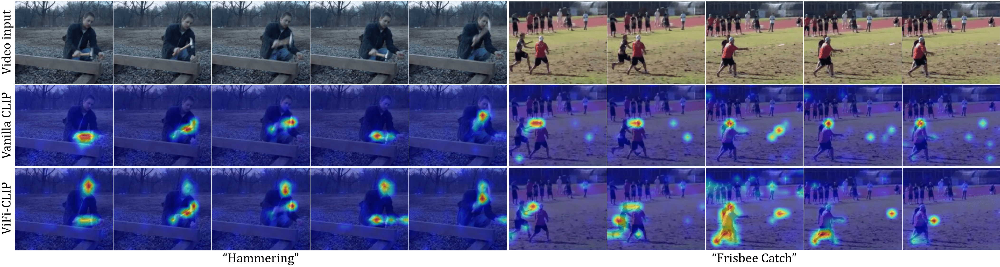

<ul class="sticky">
  <li><a href="index">Profile</a></li>
    <li><a class="active" href="publications">Publications</a></li>
  <li><a href="projects">Projects</a></li>
  <li><a href="about">About</a></li>
  <li><a href="files/MuhammadUzairKhattak.pdf">Resume</a></li>
</ul>

## Publications
 
 

<table style="width:100%;border:0;border-spacing:0px;border-collapse:separate;margin-right:auto;margin-left:auto;border-color:white">
<tbody>

<tr>
<td style="padding:20px;width:50%;vertical-align:middle">

</td>
<td style="padding:20px;width:50%;vertical-align:middle">

<strong>Fine-tuned CLIP models are efficient video learners  (Under review)</strong>
   
  Hanoona Rasheed*, <b>Muhammad Uzair Khattak*</b>, Muhammad Maaz, Salman Khan, Fahad Khan
     
<a href="https://muzairkhattak.github.io/ViFi-CLIP/">Project page</a>&nbsp;/&nbsp;<a href="https://arxiv.org/abs/2212.03640">Technical report</a>&nbsp;/&nbsp;<a href="https://github.com/muzairkhattak/ViFi-CLIP">Code</a>
 
 
 We revisit and formulate a baseline to adapt CLIP for video action recognition tasks. ViFi-CLIP (Video Fine-tuned CLIP) performs competitive to more complex approaches having dedicated components designed to model temporal information in videos.
</td>
</tr>    
        

<table style="width:100%;border:0;border-spacing:0px;border-collapse:separate;margin-right:auto;margin-left:auto;border-color:white">
<tbody>

<tr>
<td style="padding:20px;width:50%;vertical-align:middle">

</td>
<td style="padding:20px;width:50%;vertical-align:middle">

<strong>MaPLe: Multi-modal Prompt Learning  (Under review)</strong>
   
  <b>Muhammad Uzair Khattak</b>, Hanoona Rasheed, Muhammad Maaz, Salman Khan, Fahad Khan
     
<a href="https://muzairkhattak.github.io/multimodal-prompt-learning/">Project page</a>&nbsp;/&nbsp;<a href="https://arxiv.org/abs/2210.03117">Technical report</a>&nbsp;/&nbsp;<a href="https://github.com/muzairkhattak/multimodal-prompt-learning">Code</a>
 
 
A novel Prompt Learning framework to adapt both vision and language branches of CLIP to improve alignment between the vision and language representations.
MaPLe demonstrates state-of-the-art results towards novel categories, cross-dataset transfer and datasets with domain shifts.
</td>
</tr>    
        
        
</tbody>
</table>

<table style="width:100%;border:0;border-spacing:0px;border-collapse:separate;margin-right:auto;margin-left:auto;border-color:white">
<tbody>

<tr>
<td style="padding:20px;width:50%;vertical-align:middle">

</td>
<td style="padding:20px;width:50%;vertical-align:middle">

<strong>Object Detection in Aerial Images: A Case Study on Performance Improvement [ICAIoT 2022]</strong>
   
  Adnan Khan*, <b>Muhammad Uzair Khattak*</b>, Khaled Dawoud*
     
<a href="https://github.com/muzairkhattak/OD-Satellite-iSAID/blob/OD_SatteliteImages/projects/OD_satellite_iSAID/ICAIoT_2022.pdf">Technical report</a>&nbsp;/&nbsp;<a href="https://github.com/muzairkhattak/OD-Satellite-iSAID">Code</a>
 
 

Usually, architectures of object detection AI models are well-tailored and configured to be used with tasks dealing with natural images (COCO, PASCAL etc). In this work, we study that directly using the available object detectors, specifically the vanilla Faster RCNN with FPN is sub-optimal for aerial OD and the Faster R-CNN architecture and propose several modifications including changes in architecture in different blocks of detector, training & transfer learning strategies, loss formulations, and other pre-post processing techniques and achieve an absolute gain of 4.44 AP over the vanilla Faster R-CNN on the iSAID validation set.
</td>

</tr>    
        
        
</tbody>
</table>

<table style="width:100%;border:0;border-spacing:0px;border-collapse:separate;margin-right:auto;margin-left:auto;border-color:white">
<tbody>

<tr>
<td style="padding:20px;width:50%;vertical-align:middle">

</td>
<td style="padding:20px;width:50%;vertical-align:middle">

<strong>Bridging the Gap between Object and Image-level Representations for Open-Vocabulary Detection  [NeurIPS-2022]</strong>
   
 *Hanoona Rasheed, *Muhammad Maaz, <b>Muhammad Uzair Khattak</b>, Salman Khan, Fahad Khan
     
<a href="https://hanoonar.github.io/object-centric-ovd/">Project page</a>&nbsp;/&nbsp;<a href="https://arxiv.org/abs/2207.03482">Technical report</a>&nbsp;/&nbsp;<a href="https://github.com/hanoonaR/object-centric-ovd">Code</a>
 
 
In this work, we propose to solve the Open-vocabulary detection (OVD) problem using pretrained CLIP model, adapting it for object-centric local regions using region-based distillation and image-level weak supervision. Specifically, we propose to utilize high-quality class-agnostic and class-specific object proposals via the pretrained mulit-modal vision transformers (MViT). The class-agnostic proposals are used to distill region-specific information from CLIP and class-specific proposals allows us to visually ground large vocabularies. We also introduce a region-conditioned weight transfer method to get complementary benefits from both region-based distillation and image-level supervision.
</td>
</tr>    

</tbody>
</table>

<table style="width:100%;border:0;border-spacing:0px;border-collapse:separate;margin-right:auto;margin-left:auto;border-color:white">
<tbody>
<tr>
<td style="padding:20px;width:50%;vertical-align:middle">

</td>
<td style="padding:20px;width:50%;vertical-align:middle">

<strong>Investigating and Improving Common Loop Closure Failures in Visual SLAM (Under review)</strong>
 
Saran Khaliq, Muhammad Latif Anjum, Wajahat Hussain, <b>Muhammad Uzair Khattak</b>, Momen Rasool
 
<a href="https://www.researchsquare.com/article/rs-1822521/v1">Technical report</a>
 
 
We have found that ORB-SLAM frequently misses loop closures on datasets like KITTI and TUM RGB-D, contrary to
what has been reported. While the visual place recognition block of the loop closure module has been assumed to be the
cause of these failures in difficult conditions, we have discovered that it is not the sole reason. Instead, the problem seems to
lie with the relative pose estimation module that comes after the matching step. Interestingly, using SIFT-based relative pose
estimation was able to close many of the loops missed by ORB-SLAM. We also evaluated deep learning-based alternatives for
this module, but found that the performance of these methods (e.g. MapNet) was worse than classic methods even in loop
closure scenarios. Finally, we provide a dataset of challenging loop closures that were used to make these findings, which can
be used to test future loop closure methods.
</td>

</tr>    

</tbody>
</table>
